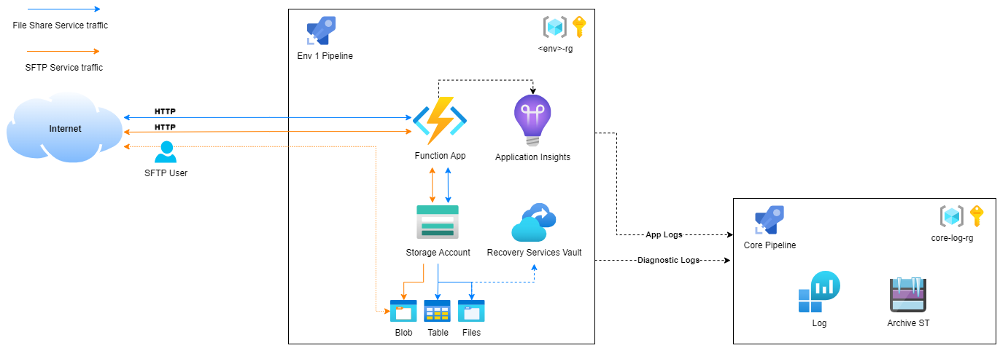
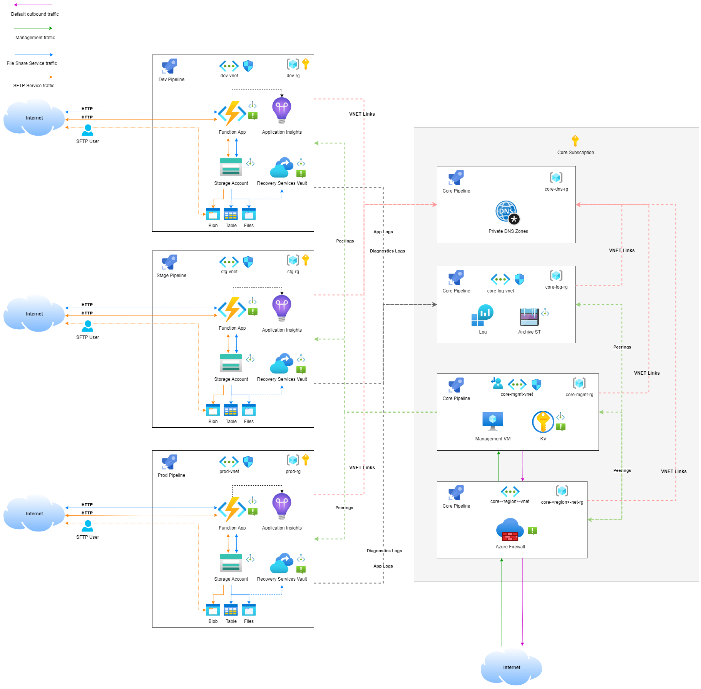

# Azure DevOps training - Project Exercise

## Exercise introduction
In this project exercise, we will be working as a DevOps team, and the work will mainly be done using a combination of _Azure DevOps_, _Azure Portal_ & _Visual Studio Code_.

---
## Table of contents
1. [What will be evaluated for the final score?](#what-will-be-evaluated-for-the-final-score)
2. [Project Levels and Goals](#project-levels-and-goals)
  * [Resource configurations for the project exercise](#resource-configurations-for-the-project-exercise)
  * [Level 1](#level-1)
  * [Level 2](#level-2)
  * [Level 3](#level-3)
  * [Level 4](#level-4)
  * [Level 5](#level-5)

---
## What will be evaluated for the final score?
_The business requirements_
* If the business requirements are met, or not, for each level of the exercise
* If certain functionality and conditions within the business requirements are working as expected

_Environment setup in Azure_
* Naming convention of resources
* Resource-groups structure
* Configuration on individual resources from a best practice & security perspective
* Cost efficiency
* Network IPv4 subnetting and IP-planning
* Network security adaptations and segmentations
* Principle of least privilege (POLP) for users, applications and managed identities
* Tags for traceability back to code & pipelines

_Code repository_
* Structure of the code repository
* Branch policies

_Code_
* Code logic
* Code structure
* Modularity
* Readability

_Pipelines_
* Pipeline flow / structure
* Full environment deployments from scratch
* Idempotency

---
## Project Levels and Goals
_The project levels reflects different levels of difficulties for the exercise._ 

### Resource configurations for the project exercise
_Additional details for expected resource configurations to reach certain levels can be found here: [RESOURCE-CONFIGURATIONS.md](Docs/RESOURCE-CONFIGURATIONS.md)_ 

---
## Level 1
_The general goal of Level 1 is to start introducing our File Share service to our customers._

  
Level 1 Overview Diagram

  
  

_Business requirements for Level 1_
* Customers should be able to send a POST HTTP-request to a function in the environment function app which creates a file share in the environment storage account
  * The customer HTTP-request order should only be accepted if it contains at least the following values:
    * `filesharename` - _This should be the name of the file share that gets created._
    * `firstname` - _First name of the person who created the order._
    * `lastname` - _Last name of the person who created the order._
  * The details for the order should be populated into a storage account _table_ called `FileshareOrders`.
    * These details should include all the data from the parameter inputs (`filesharename`, `firstname`, `lastname`) in the HTTP-request order, but also details such as the `date` it was ordered.
  * If everything succeeded, the results should be returned as a HTTP-response containing `StatusCode` - `200 OK` and the `Share URL` of the created file share. As well as any other details that might be good to return in the response.
  * If the HTTP-request is _not_ successful, it is expected that a descriptive error message is returned to the caller with `StatusCode` - `400 BadRequest`.
* In order to protect our customers data in the file shares, it is expected that each existent file share has a daily backup to a Recovery Services Vault.
* It is expected that the full setup of resources and configurations for the Level 1 business requirements is done using IaC and Azure Pipelines.

---
## Level 2
_The general goal of Level 2 is to start introducing our SFTP service to our customers._

  
Level 2 Overview Diagram

  
  

_Business requirements for Level 2_

* Customers should be able to send a POST HTTP-request to a function in the environment function app which creates an SFTP user, and a _container_ that will be the SFTP user's home-directory for the SFTP service
  * The customer HTTP-request order should only be accepted if it contains at least the following values
    * `containername` - _Name of the storage account blob container that will get created, and should be the home-directory for the SFTP user._    
    * `username` - _Name of the SFTP user that will be created._
    * `firstname` - _First name of the person who created the order._
    * `lastname` - _Last name of the person who created the order._    
    * `company` - _Name of the company of the client who created the order._
  * The details for the order should be populated into a storage account _table_ called `SFTPOrders`.
  * If everything succeeded, the results should be returned as a HTTP-response containing `StatusCode` - `200 OK`.
    * The HTTP response should also contain the following values:
      * `username` - _Name of the SFTP user that were created._
      * `sshpassword` - _SSH password that the customer will use to connect to the SFTP service._
      * `connection-string` - _Connection string for the user for when using the SFTP service._
  * If the HTTP-request is _not_ successful, it is expected that a descriptive error message is returned to the caller with `StatusCode` - `400 BadRequest`.
  * The SFTP user should have full permissions from the home-directory.
  * It is important that our customers has their own dedicated encryption scopes so for each company that has ordered from our SFTP service, there should be a dedicated encryption scope for their blob containers.
  * In order to gain better insights in the daily operations of our Function App, it is expected that we start collecting `application logs` using Application Insights for our Function App.
    * The application logs should be collected into a Log Analytics Workspace that is deployed in `core`.
* In order to gain better insights in the daily operations of our resources, it is expected that we start collecting `diagnostic logs` for all our resources in the environment.
  * The diagnostic logs should be collected into a Log Analytics Workspace, and archived into a Storage Account with lifecycle management policies.
    * These resources should be placed into it's own resource-group so that it can easily be used by multiple environments. We will call the environment that contains shared resources for `core`.
      * The resources in `core` should have it's own dedicated Azure Pipeline.
* It is expected that the full setup of resources and configurations for the Level 2 business requirements is done using IaC and Azure Pipelines.

---
## Level 3
_The general goal of Level 3 is securing our resources by introducing internal networks, private endpoints and privatelinks as well as a dedicated management VM._

  
Level 3 Overview Diagram

  
  

_Business requirements for Level 3_

* Secure Azure resources from unnecessary exposure to the internet.
  * This requires us to set up internal networking using VNet's, Private Endpoints and Privatelinks
    * We also need to ensure we are creating the expected privatelink private DNS zones for the different resource-types.
    * The connectivity between the different VNet's should be done possible using VNet peerings.
* Ensure all management can only be done from a dedicated management VM.
* Ensure we have default network ACLs in place (NSGs) and traffic only allowed for expected ports.
  * It is expected that NSG's are attached to all subnets in each VNet.
* Some of these resources should be placed into it's own resource-group so that it can easily be used by multiple environments. We will call the environment that contains shared resources for `core`.
  * The logs should be collected into a Log Analytics Workspace, and archived into a Storage Account with lifecycle management policies.
  * The resources in `core` should have it's own dedicated Azure Pipeline.
* It is expected that the full setup of resources and configurations for the Level 3 business requirements is done using IaC and Azure Pipelines.

---
## Level 4
_The general goal of Level 4 is to start securing our inbound/outbound network traffic by introducing an Azure Firewall._ 
_In addition we will be adding route tables with default routes that ensures traffic is passing by the Azure Firewall before reaching the internet._ 
_In this level we also want to add observability to our most crucial resources by adding monitoring / alerting to the most important performance metrics of these resources._ 
_In this level we also want to add `Tags` to our resources, and our main requirement for the tags is to have traceability back to the IaC code, using [Azure pipelines predefined variables](https://learn.microsoft.com/en-us/azure/devops/pipelines/build/variables?view=azure-devops&tabs=yaml) might be of good use here._ 

  
Level 4 Overview Diagram

  
  

_Business requirements for Level 4_
* Secure inbound/outbound traffic flows by using Azure Firewall in combination with route tables for default routes
* Add `observability` for our most crucial resources by introducing alerts on resource metrics.
* Add `traceability` for our IaC deployed resources by using `tags`.
* Some of these resources should be placed into it's own resource-group so that it can easily be used by multiple environments. We will call the environment that contains shared resources for `core`.
  * The logs should be collected into a Log Analytics Workspace, and archived into a Storage Account with lifecycle management policies.
  * The resources in `core` should have it's own dedicated Azure Pipeline.
* It is expected that the full setup of resources and configurations for the Level 4 business requirements is done using IaC and Azure Pipelines.

---
## Level 5
_The general goal of Level 5 is to scale up our environments that reflects our business resources from 1 to 3 environments (development / stage & production)._ 

  
Level 5 Overview Diagram

  
  

_Business requirements for Level 5_
* In order to work more effectivly and decrease our `Time to market` we want active development of our services to mainly be done in our `Development (dev)` environment.
  * When new improvements to the code has been added to `dev` and the pipeline runs successfully, we want to push it up to the `stage` environment, where we should also be running functional test for the new code.
    * If everything went successful in `dev` and `stage`, it is ready to be deployed to `production`.
      * It is expected that we also have functional testing after the new code has been deployed to `production`.
* It is expected that the full setup of resources and configurations for the Level 5 business requirements is done using IaC and Azure Pipelines.