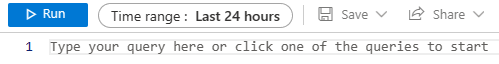

# Azure Security Practical Exercises
_The exercises in this section should primarily be performed logged in to the [Azure Portal](https://portal.azure.com), or using tools such as **Powershell** or **Azure CLI**_.<br>
_The exercises are based on each student having a subscription available and at least `Contributor` access permissions to that subscription._<br>

##### Legend for exercises
:exclamation: - _Step or instruction is highly likely to run into problem/error that your goal is to solve._<br>
:link: - _Step or instruction assumes a prior step or exercise has been performed.
If instructions are in code, it is assumed the same workspace or process is used as from prior steps._<br>

---
## Table of contents for exercises
1. [Exercise - Evaluate your Azure user license](#exercise---evaluate-your-azure-user-license)
2. [Exercise - Create and explore Azure Keyvault resource](#exercise---create-and-explore-azure-keyvault-resource)
3. [Exercise - Create an Azure Storage Account resource](#exercise---create-an-azure-storage-account-resource)
4. [Exercise - Set your Azure Storage Account to use Microsoft Entra authorization by default and add Azure RBAC permissions](#exercise---set-your-azure-storage-account-to-use-microsoft-entra-authorization-by-default-and-add-azure-rbac-permissions)
5. [Exercises for Azure Storage Account - Blob Services](#exercises-for-azure-storage-account---blob-services)
6. [Exercises for Azure Storage Account - File Services](#exercises-for-azure-storage-account---file-services)
7. [Exercises for Log Analytics Workspaces](#exercises-for-log-analytics-workspaces)

---
## Exercise - Evaluate your Azure user license
1. In the portal, go to `Microsoft Entra ID`.
2. In the left side menu, go to `Users` -> Press `<Your-Username>`
3. Find out what `Licenses` has been assigned to your user
    * What are the name(s) of the assigned license(s) to your user?

---
## Exercise - Create and explore Azure Keyvault resource
_This exercise is meant to explore the creation and options for Azure Keyvault resources._<br>
The different configuration values suggested are focused on keeping the resource cost low while ensuring easy access to the resource as part the training._<br>

:information_source: _A good naming standard for your resources would be to follow the [Abbreviation examples for Azure resources](https://learn.microsoft.com/en-us/azure/cloud-adoption-framework/ready/azure-best-practices/resource-abbreviations)_.<br>

1. In the portal, go to `Key vaults`.
2. In the upper left corner, press `Create`.
3. On the `Basics` tab, choose your subscription and fill in all values as you see fit except the following:
    * `Pricing tier` should be set to `Standard`.
    * `Days to retain deleted vaults` should be set to **7** days.
    * `Purge protection` should be set to `Disabled`.
  
    Once everything is filled in, press `Next`.
4. On the `Access configuration` tab, ensure the `Permission model` is set to Azure role-based access control (`Azure RBAC`) thereafter press `Next`. The other options are optional for now. 
5. On the `Networking` tab, ensure `Enable public access` is checked, and that `Allow access from` is set to `All networks` thereafter press `Next`.
6. On the `Tags` tab, optionally add any tags if you would like, thereafter press `Next`.
7. On the `Review + create` tab, press `Create` to create your Azure Keyvault resource.
    * What happened after you pressed `Create` ?

---
### Explore your Azure Keyvault resource
1. In the portal, go to `Key vaults` -> Press `<Your-Keyvault-Name>`
2. In the left side menu, explore the `Objects` section
    * What is found/stored here?
    * :exclamation: Test creating any Key, Secrets or Certificates
3. In the left side menu, explore the `Settings` section
    * What is your `Vault URI` ?
4. In the left side menu, explore the `Monitoring` section
    * Any `Alerts` configured ?
    * Any `Metrics` available ?
    * Any `Diagnostic settings` configured ?
5. In the left side menu, explore the `Automation` section
    * What do we find under `CLI / PS`?
    * What do we find under `Export template`?
      * What format is the template in ?
      * What is this type of template called ?
      * What do you see inside this template ?

---
### Explore secrets in your Azure Keyvault
1. In the left side menu of your Keyvault, go to `Secrets` -> `Generate/Import`
2. Generate a new secret by entering a name for your secret as well as your secret value.<br>
   Once the secret is created, go into the secret by clicking on the name of the secret.
3. Press the row under `CURRENT VERSION` which contains the identifier for your created secret. 
    * What can we see inside the secret ?
      * Can this secret be reached from external networks ? If so, how and why ?
      * Can we limit how the secret is accessed from within the secret ?
      * Can we limit when the secret can be access from within the secret ?
      * Can we expose the secret value ?
4. Now go back to `Secrets` -> `<Name-of-your-secret>` -> Press `New Version` and create a new version of your secret by entering a new secret value, and pressing `Create`.
    * What happened when you created the new version of the secret ?
    * What do you think happends when we programmatically request the secret-value of `<Name-of-your-secret>` now ?
    * Can the old version still be accessed and referenced ? If so, how ?

---
## Exercise - Create an Azure Storage Account resource
_This exercise is meant to explore the creation and options for Azure Storage Account resources._<br>
_The different configuration values suggested are focused on keeping the resource cost low while ensuring easy access to the resource as part the training._<br>

:information_source: _A good naming standard for your resources would be to follow the [Abbreviation examples for Azure resources](https://learn.microsoft.com/en-us/azure/cloud-adoption-framework/ready/azure-best-practices/resource-abbreviations)_.<br>

1. In the portal, go to `Storage accounts`.
2. In the upper left corner, press `Create`.
3. On the `Basics` tab, choose your subscription and fill in all values as you see fit except the following: <br>
`Performance` should be set to `Standard`.<br>
`Redundancy` should be set to `Locally-redundant storage (LRS)`.<br>
Once everything is filled in, press `Next`.<br>
    * Did you notice anything about the format of the `Storage account name` ?
4. On the `Advanced` tab, leave everything with their default settings except the following:<br>
    * For the `Security` section, review the settings and try to set the most secure configuration possible for the storage account.
      However, leave the `Enable storage account key access` box checked in. 
      Thereafter press `Next`.
5. On the `Networking` tab:<br>
 `Network access` should be set to `Enable public access from all networks`.<br>
 `Routing preference` should be set to `Microsoft network routing`.<br>
 Thereafter press `Next`.<br>
6. On the `Data protection` tab, review the settings and leave them as their defaults, thereafter press `Next`.
7. On the `Encryption` tab, review the settings and leave them as their defaults, thereafter press `Next`.
8. On the `Tags` tab, optionally add any tags if you would like, thereafter press `Next`.
7. On the `Review + create` tab, press `Create` to create your Azure Storage account resource.
    * What happened after you pressed `Create` ?

---
### Exercise - Set your Azure Storage Account to use Microsoft Entra authorization by default and add Azure RBAC permissions
1. On the left side menu of the storage account resource, go to `Configuration`.
2. Set the option `Default to Microsoft Entra authorization in the Azure portal` to `Enabled` and press `Save`.
3. Finally, add role assignments for your user to be able to read & write to the `Blob` & `File` services of your storage account.

---
### Exercises for Azure Storage Account - Blob Services
_These exercises are focused on the [blob](https://learn.microsoft.com/en-us/azure/storage/blobs/storage-blobs-introduction) services for the Azure Storage Account resource._

#### Exercise - Upload and download blobs to/from private storage account containers using different methods
1. In the left side menu of the storage account resource, go to `Containers` and press `+ Container`, select a name for your container, and press `Create`. 
2. Go into your newly created container, and `Upload` any file to become a storage account blob.
3. Test different ways of ***downloading*** your blob
    1. Find a way to `Download` the same blob you just uploaded using the _Azure portal_ directly.
    2. Generate a SAS-token ***only*** for the specific blob and use it to download your blob

        ---
        * Using your web browser and browsing to `<Blob-SAS-URL>`
        ---
        * Using `Powershell` and example command <br> 
          ``` Powershell
          Invoke-WebRequest -Uri "<Blob-SAS-URL>" -OutFile "<Local-path-where-I-want-my-file>"
          ```
        ---
        * Using [azcopy](https://learn.microsoft.com/en-us/azure/storage/common/storage-use-azcopy-v10#download-azcopy) tool and command example<br>
          ``` Powershell
          azcopy copy "<Blob-SAS-URL>" "<Local-path-where-I-want-my-file>"
          ```

---
#### Exercise - Create a publicly available container
1. Use either of these methods for creating your storage account container

    ---
    * Using `Azure Portal`
        * On the left side menu of the storage account resource, go to `Containers` and press `+ Container`, select a name for your container, and press `Create`.
    ---        
    * Using `Powershell`
        ``` Powershell
        # Sign in using your own Azure credentials
        Connect-AzAccount -Tenant "<GUID-of-tenant>"

        # Get the storage account and populate it in a variable
        $StorageAccount = Get-AzStorageAccount -Name "<storage-account-name>" -ResourceGroupName "<storage-account-resource-group-name>"

        # Create a storage account container
        New-AzStorageContainer -Context $StorageAccount.Context -Name "<container-name>"
        ```
    ---
    * Using [azcopy](https://learn.microsoft.com/en-us/azure/storage/common/storage-use-azcopy-v10#download-azcopy) tool
        * For the `<Blob-service-URL>` we can do _either_
            * Write it like this `https://<storage-account-name>.blob.core.windows.net/`

            _or_

            * Find it under `Endpoints` in the left side menu of the storage account.
        ``` Powershell
        azcopy make "<Blob-service-URL><container-name><Container-SAS-token>"
        ```
        _Successfully creating the container would result in the output:_<br>
        `Successfully created the resource.`

2. :exclamation: Set your container to be publicly available using either methods
    * Using `Azure Portal`
        1. On the left side menu of the storage account resource, go to `Containers`
        2. Mark the checkbox next to your container, and press `Change access level`, change the access level to `Container`.
    ---
    * :link: Using `Powershell`
        ``` Powershell
        Set-AzStorageContainerAcl -Context $StorageAccount.Context -Container "<container-name>" -Permission Container -PassThru
        ```
3. Upload any file to become a blob in your new container.
4. Now using your web browser test to browse to the blobs within your container. The full URL of the blob can be found under the properties of the blob.

---
#### Exercise - Create a lifecycle management policy for your storage account blobs
1. In the left side menu of the storage account resource, go to `Lifecycle management` and press `+ Add rule`.
2. On the `Details` tab, enter the following:
    * `Rule name` - _Enter a descriptive name for your lifecycle management policy._
    * `Rule scope` - _Set this to `Apply rule to all blobs in your storage account`._
    * `Blob type` - _Enable the policy for all blob types._
    * `Blob subtype` - _Enable only `Base blobs` here._
3. In the bottom left, press `Next`.
4. On the `Base blobs` tab

    _In the `if` statement_
    * `Base blobs were *` - `Last modified`
    * `More than (days ago)` - Set this to **30**

    _In the `then` statement_
    * Use `Delete the blob`
5. In the bottom left corner, press `Add`.
    * What did we achieve by creating the lifecycle management policy?

---
### Exercises for Azure Storage Account - File Services
_These exercises are focused on the [files](https://learn.microsoft.com/en-us/azure/storage/files/storage-files-introduction) services for the Azure Storage Account resource._

#### Exercise - Upload and download files from storage account file share using different methods
1. In the left side menu of the storage account resource, go to `File shares` and press `+ File share`, select a name for your file share, and press `Next: Backup`. 
    * Uncheck the `Enable backup` as we do not need any backups for this training scenario, and press `Next: Review`
    * Go inside your share by going to `File shares` -> `<file-share-name>` on the storage account if needed.
2. Test different ways of ***uploading*** your files
    
    1. Inside your newly created file share, try to `Upload` any file using the _Azure Portal_ directly.
    ---
    2. Generate a SAS-token ***only*** for the `File` services of the storage account with sufficient permissions for writing data.<br>
        * The SAS-token requires `Allowed resource types` to have `Object` as allowed.
        * For the `<File-service-URL>` we can do _either_
            * Write it like this `https://<storage-account-name>.file.core.windows.net/`

            _or_

            * Find it under `Endpoints` in the left side menu of the storage account.
        
        _Examples using [azcopy](https://learn.microsoft.com/en-us/azure/storage/common/storage-use-azcopy-v10#download-azcopy) tool_

        
        ``` Powershell
        # Upload 1 file
        # <file-name> is what the file will be called once uploaded
        azcopy copy "<local-path-to-FILE-to-upload>" "<File-service-URL><file-share-name>/<file-name><SAS-token>"

        # Upload a folder and all files in it
        azcopy copy "<local-path-to-FOLDER-to-upload>" "<File-service-URL><file-share-name><SAS-token>" --recursive
        ```
    ---
    3. Use your own Azure account and `Powershell` to upload the file
        ``` Powershell
        # Sign in using your own Azure credentials
        Connect-AzAccount -Tenant "<GUID-of-tenant>"

        # Get the storage account and populate it in a variable
        $StorageAccount = Get-AzStorageAccount -Name "<storage-account-name>" -ResourceGroupName "<storage-account-resource-group-name>"

        # Upload specified file to specified share using the saved storage account context from variable
        Set-AzStorageFileContent -Context $StorageAccount.Context -ShareName "<file-share-name>" -Source "<local-path-to-my-file>"
        ```

---
#### Exercise - (Windows) Mount your storage account file share as a network drive on your computer
1. First, find one of the storage account `Access keys`
2. Using `Powershell` run the following command example
    ``` Powershell
    # Use the storage account access key when prompted for password after running this command
    $Credential = Get-Credential -Username "localhost\<storage-account-name>"

    # UNC path for storage account file share
    $UncPath = "\\<storage-account-name>.file.core.windows.net\<file-share-name>"

    # Mount your network drive to X:
    New-PSDrive -Name X -PSProvider FileSystem -Root $UncPath -Persist -Credential $Credential
    ```
    :information_source: _More information about UNC-paths can be found [here](https://learn.microsoft.com/en-us/dotnet/standard/io/file-path-formats#unc-paths)_.
3. On your Windows PC, go to `File Explorer` -> `This PC` and find your newly mounted drive on `X:`
    * Test adding and removing files from the mounted network drive
      * See how the changes are reflected on the file share in the `Azure Portal` as well
4. :link: (Optional) Disconnect your mounted network drive using `Powershell`
    ``` Powershell
    Remove-PSDrive X
    ```

---
## Exercises for Log Analytics Workspaces
_These exercises are focused on creating and exploring different use case scenarios for Azure Log Analytics workspace resources._<br>

:information_source: _A good naming standard for your resources would be to follow the [Abbreviation examples for Azure resources](https://learn.microsoft.com/en-us/azure/cloud-adoption-framework/ready/azure-best-practices/resource-abbreviations)_.<br>

---
### Exercise - Create a Log Analytics Workspace
1. In the portal, go to `Log Analytics workspaces`.
2. In the upper left corner, press `Create`.
3. On the `Basics` tab, set your desired `Subscription`, `Resource group`, `Name` & `Region` for your Log Analytics workspace.

---
#### Exercise - Add diagnostic settings for your other resources to send logs to your Log Analytics workspace
_Perform the same steps below for both your **Keyvault** and **Storage Account** resource._<br>

:information_source: _For the `Storage Account`, add diagnostic settings for the sub-services `Blob` & `File`._

1. :link: In the portal, go to your already created `<Resource>`.
2. In the left side menu, press `Diagnostic settings`.
3. Press `+ Add diagnostic settings`.
4. _Configure your diagnostic settings:_
    * Enter a name for your diagnostic setting under `Diagnostic setting name`.
    * In the left side under `Logs`, mark all available options.
    * In the left side under `Metrics`, ensure it is ***not*** checked in.
    * On the right side, press `Send to Log Analytics workspace` and choose your created `Log Analytics workspace`.
5. Finally, press `Save` to create the diagnostic settings.

---
#### Exercise - Use KQL queries to examine your gathered logs in the Log Analytics workspace
:information_source: _After diagnostic settings are created for your resources, it will most often take 5-10 minutes initially until logs starts showing up for the specific resource. For logs to show up from a specific resource, logically some log-generating events must have occured on the resource for it to produce logs._

1. In the portal, go to `Log Analytics workspaces` -> `<Name-of-your-Log-Analytics-Workspace>`.
2. In the left side menu, go to `Logs`.
    * Close down the `Queries` window that pops up by default if needed.
3. In the empty query section, start writing your KQL query to look at the collected diagnostic logs from your configured resources.

    
    
    * The diagnostic logs are always found in a _table_ called `AzureDiagnostics`.

    _Some simple KQL query examples_
    ``` Kusto
    // Query all logs in table AzureDiagnostics
    AzureDiagnostics
    ```
    ``` Kusto
    // Query all logs that are from Keyvault resources
    AzureDiagnostics
    | where ResourceProvider == "MICROSOFT.KEYVAULT"
    ```
    ``` Kusto
    // Query all logs and count them
    AzureDiagnostics
    | count
    ```

    _Storage account Blob logs_
    ``` Kusto
    // Query all logs for storage account blobs
    StorageBlobLogs
    ```

    _Storage account File logs_
    ``` Kusto
    // Query all logs for storage account files
    StorageFileLogs
    ```

    _Some more examples for KQL operators can be found [here](https://learn.microsoft.com/en-us/azure/data-explorer/kusto/query/tutorials/learn-common-operators), and [here](https://learn.microsoft.com/en-us/azure/data-explorer/kusto/query/tutorials/use-aggregation-functions)._<br>
    _Test around and find out what more that you can do!_<br>

---
#### Exercise - Cleart an alert based on your KQL query
:information_source: _Try to create an alert that is from a filtered query, meaning we aim for some specific type of events, and also to avoid spamming a lot of alert emails._

1. :link: While inside `Logs` of your Log Analytics Workspace, and viewing the section where you can write a KQL query, press `+ New alert rule`.

     

2. In the `Condition` tab, ensure the following values:
    
    ***Measurement***
    * _Signal name_ -> `Custom log search`
    * _Measure_ -> `Table rows`
    * _Aggregation type_ -> `Count`

    ***Split by dimensions***
    * Set as the current default, do not adjust

    ***Alert logic***
    * _Operator_ -> Set as you see fit
        * Indicates the behaviour of the alert, do we alert if `Greater than` _X_ count, or `Less than` _X_ count, etc.
    * _Threshold value_ -> Set as you see fit
        * Indicates how many times it should occur (_X_) before we reach the threshold to send the alert
3. Press `Next: Actions`.
4. If you do not already have a prepared [action group](https://learn.microsoft.com/en-us/azure/azure-monitor/alerts/action-groups) for the alert, then press `+ Create action group`, otherwise you can choose the one you have already created.

    1. _Create action group_
        * _Region_ -> `Global`
        * _Action group name_ -> Set a name for your AG, preferred Azure abbreviation is `ag`
        * _Display name_ -> Set the preferred display name (12 character limit)
    2. Press `Next: Notifications`
        * _Notification type_ -> `Email/SMS message/Push/Voice`
            * On the right side menu, mark `Email` and insert your email-address, and then press `OK`.
        * _Name_ -> Set your preferred name for the notification
    3. Press `Next: Actions`
        * We will skip the `Actions` sections, but please check out what other options are available.
    4. Press `Review + create`
5. Press `Next: Details`.
6. In the `Details` tab, ensure the following values:
    
    ***Alert rule details***
    * _Severity_ -> Insert your preferred severity of the alert
        * Indicates the level of importance of the alert
    * _Alert rule name_ -> Set a descriptive name of your alert rule
    * _Alert rule description_ -> Describe the intention of the alert
    * _Region_ -> Set your preferred region for the alert rule
7. Press `Review + create`.

_After this has been created, you should now receive alerts to your email-address if the conditions specified in the alert are met._

    