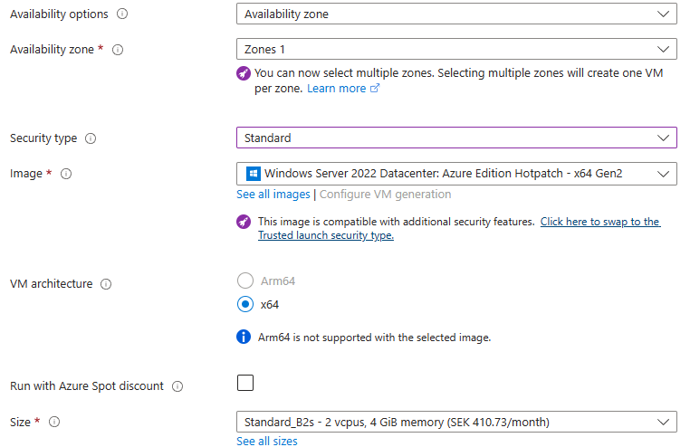
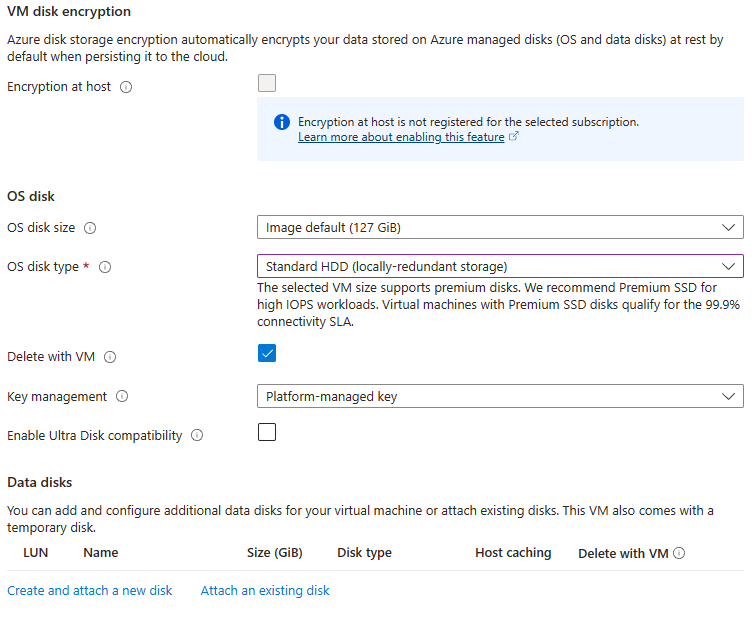

# Azure Networking Practical Exercises
_The exercises in this section should primarily be performed logged in to the [Azure Portal](https://portal.azure.com), or using tools such as **Powershell** or **Azure CLI**_.<br>
_The exercises are based on each student having a subscription available and `Contributor` access permissions to that subscription._<br>

##### Legend for exercises
:exclamation: - _Step or instruction is highly likely to run into problem/error that your goal is to solve._<br>
:link: - _Step or instruction assumes a prior step or exercise has been performed.
If instructions are in code, it is assumed the same workspace or process is used as from prior steps._<br>

##### Example network setup for exercises
_The network example is to ensure we do not run into IP/network collisions for network to network integrations._
```
10.0.1.0/24 # Student 1
10.0.2.0/24 # Student 2
10.0.3.0/24 # Student 3
10.0.4.0/24 # Student 4
10.0.5.0/24 # Student 5
10.0.6.0/24 # Student 6
10.0.7.0/24 # Student 7
10.0.8.0/24 # Student 8
10.0.9.0/24 # Student 9
```

---
## Table of contents for exercises
1. [Exercise - Create a Virtual Network (VNet)](#exercise---create-a-virtual-network-vnet)
2. [Exercise - Create a Network Security Group (NSG) and attach it to a subnet](#exercise---create-a-network-security-group-nsg-and-attach-it-to-a-subnet)
3. [Exercise - Configure NSG Flow Logs for your Network Security Group (NSG)](#exercise---configure-nsg-flow-logs-for-your-network-security-group-nsg)
4. [Exercise - Create a Virtual Machine (VM) and connect it to your VNet](#exercise---create-a-virtual-machine-vm-and-connect-it-to-your-vnet)
5. [Exercise - Connect to your Virtual Machine using Remote Desktop Protocol (RDP)](#exercise---connect-to-your-virtual-machine-using-remote-desktop-protocol-rdp)
6. [Exercise - Create a DNS record/name for your VM](#exercise---create-a-dns-recordname-for-your-vm)
7. [Exercise - Improve the encryption settings of your VM OS-disk](#exercise---improve-the-encryption-settings-of-your-vm-os-disk)
8. [Exercise - Deploy a Bastion for your VNet](#exercise---deploy-a-bastion-for-your-vnet)
9. [Exercise - Create private access to a Keyvault resource](#exercise---create-private-access-to-a-keyvault-resource)
10. [Pair Exercise - Fix connectivity between your VNets using VNet Peering](#pair-exercise---fix-connectivity-between-your-vnets-using-vnet-peering)
11. [Exercise - Explore the Windows Admin Center (WAC)](#exercise---explore-the-windows-admin-center-wac)

---
## Exercise - Create a Virtual Network (VNet)
_This exercise is meant to explore the creation and options for Virtual Network resources._<br>

:information_source: _Other exercises will involve VNet to VNet integrations so ensure you are not using the same network range as your fellow students._

1. In the portal, go to `Virtual networks`.
2. In the upper left corner, press `Create`.
3. On the `Basics` tab, set or create your desired resource-group for the VNet, and the name of the VNet to be created.
4. On the `Security` tab, ensure no options are checked in, and press `Next`.
5. On the `IP addresses` tab, see [Example network setup for exercises](#example-network-setup-for-exercises) and use it to avoid network collisions with your fellow students.
    * Set the `Address space` CIDR as the range chosen from the example
      * Remove the subnet called `default`
      * Add 1 subnet for now called `snet1` with a CIDR of `/27` within your `Address space` of the VNet
        * On the `Add a subnet` bar on the right side of the screen, all options for the `Security` section should be set to `None`
6. Press `Review + Create` and then `Create`.

---
## Exercise - Create a Network Security Group (NSG) and attach it to a subnet
_This exercise is meant to explore the creation and options for Network Security Group resources._<br>

1. In the portal, go to `Network security groups`.
2. In the upper left corner, press `Create`.
3. :link: On the `Basics` tab, set the same resource-group as where your VNet is located, and then the name of the NSG to be created.
4. Press `Review + Create` and then `Create`.
5. :link: Attach your newly created NSG to the `snet1` subnet.

---
## Exercise - Configure NSG Flow Logs for your Network Security Group (NSG)
1. In the portal, go to `Network security groups`.
2. :link: Press your already created NSG.
3. In the left side menu of the NSG, go to `NSG flow logs`.
4. Press `Create`.
5. :link: On the `Basics` tab, select your already existent storage account and set the `Retention (days)` to `7`.
6. :exclamation: On the `Analytics` tab, for `Flow Log Version` set `Version 2`.<br>
   Check `Enable Traffic Analytics`, set the `Traffic Analytics processing interval` to `Every 1 hour`.
7. Press `Review + Create` and then `Create`.

#### View the Traffic Analytics NSG Flow Logs
:information_source: _It will take a while until `Traffic Analytics` data is populated into the log analytics workspace. Until the data is populated, you will get an error. You can give it some time and return to this section later if needed._

1. In the portal, go to `Log Analytics workspaces`.
2. Press the name of the log analytics workspace that were used to configure `Traffic Analytics` for the NSG Flow Logs.
3. In the left side menu, go to `Logs`
4. Find the `Traffic Analytics` logs by running the following query:
  ```
  AzureNetworkAnalytics_CL
  ```

---
## Exercise - Create a Virtual Machine (VM) and connect it to your VNet
_This exercise is meant to explore the creation and options for Virtual Machine resources._<br>
_The different configuration values suggested are primarily focused on keeping the resource cost low._

1. In the portal, go to `Virtual Machines`.
2. In the upper left corner, press `Create`.
3. :link: On the `Basics` tab, set the same resource-group as where your VNet is located, and then the `Virtual machine name` of the VM to be created. Set the `Region` as the same value as your VNet.
  * Set the following values as in the screenshot
  
* Set your desired `Username` and `Password`
    * Please note that this is the **local** `Administrator` account of the VM
* For the `Inbound port rules` section select `None`.
* For the `Licensing` section leave the option unchecked.
4. On the `Disks` tab, set the values as in the screenshot

5. On the `Networking` tab, set the values as in the following:
    * `Virtual network` should be set to your already created VNet.
    * `Subnet` should be set to your already created subnet.
    * `Public IP` leave as-is to get a public IP created with the `<vm-name>-ip` format.
    * `NIC network security group` should be set to `None`.
    * `Delete public IP and NIC when VM is deleted` should be checked in.
    * `Load balancing options` should be set to `None`.
6. On the `Management` tab, enable `Login with Azure AD`. Leave the rest on their defaults.
7. We will skip the remaining tabs for now, so press `Review + create` and then `Create`.

---
## Exercise - Connect to your Virtual Machine using Remote Desktop Protocol (RDP)
_In this exercise we will be using the Remote Desktop Protocol (RDP) to connect to our VM using different sets of credentials. RDP uses the port `3389` by default._<br>

#### Connect to the VM using the local administrator account
1. Find the _public IP_ of your VM and note it down.
2. Press the Windows-key + R, write `mstsc` and press Enter.
3. :exclamation: In the `Computer` field, enter the public IP of your VM to initiate an RDP connection towards it.
    * Use the `Username` and `Password` that you set during the VM creation as credentials for the connection
4. Sign out from your current session and user
    * Manually
        * In the bottom left corner, right click, `Shut down or sign out` -> `Sign out`
    * Programmatically 
        * Open `cmd` or `Powershell`
          ```
          quser
          logoff <session-id-here>
          ```

---
## Exercise - Create a DNS record/name for your VM
1. :link: In the left side menu of the VM under `Overview`, configure a `DNS name` for your VM.
    * Do **not** create a new DNS Zone, use the one you should currently be able to see while doing the configuration.
2. Test out your new DNS record for the VM by RDP connecting towards the DNS name.

---
## Exercise - Improve the encryption settings of your VM OS-disk
1. :link: In the left side menu of the VM press `Disks`.
2. :exclamation: Enable the feature `Encryption at host` for the VM OS-disk

    <details>
    <summary><i>Hints</i></summary>

    :information_source: _Some features for different resource-types are not enabled by default, and needs to be enabled/registered from the subscription-level._<br>
    _In this case, `Encryption at host` for Virtual Machines (VM's), are such type of feature, hence it has to be enabled on the subscription before it can be used._<br>
    
    _In [this link](https://learn.microsoft.com/en-us/azure/virtual-machines/disks-enable-host-based-encryption-portal?tabs=azure-powershell) it is described how this particular feature is enabled, but in general, the same type of Powershell commands can be used for other resource-types and features that are not enabled by default._<br>

    :warning: Ensure you have the correct context before running the commands, so that we do not activate features on subscriptions we do not intend to.
    ``` Powershell
    # Checks the current status of the feature
    Get-AzProviderFeature -FeatureName "EncryptionAtHost" -ProviderNamespace "Microsoft.Compute"

    # Registers the current subscription (context) for the 'Encryption at host' feature
    Register-AzProviderFeature -FeatureName "EncryptionAtHost" -ProviderNamespace "Microsoft.Compute"
    ```
    _You can rerun the first command again and again to check the status, once it says `Registered` we have successfully enabled the feature for the subscription._

    </details>

---
## Exercise - Deploy a Bastion for your VNet
1. :link: In the left side menu of the VM press `Bastion`.
2. Deploy a Bastion for your VNet.
    * What happends when we deploy this Bastion?

#### Connect to your VM using the Bastion and the private IP of the VM
1. First, find a way to remove/disassociate the public IP of your VM.
2. :link: Once the public IP of the VM has been removed, in the left side menu of the VM press `Bastion`.
3. Use your VM `local administrator account` credentials to connect to your VM.
    * What did we achieve by introducing the Bastion?
    * Would the exercises in [Exercise - Connect to your Virtual Machine using Remote Desktop Protocol](#exercise---connect-to-your-virtual-machine-using-remote-desktop-protocol-rdp) still work now?

#### Connect to your VM using the Bastion and get the user credentials from your Azure Keyvault
1. If you do not already have a Keyvault resource, see [Exercise - Create and explore Azure Keyvault resource](../2-Azure-Security/2-Azure-Security-Practical-Exercises.md#exercise---create-and-explore-azure-keyvault-resource).
2. In the portal, go to `Key vaults` -> Press `<Name-of-your-Keyvault>`.
3. In the left side menu, go to `Secrets` -> Press `+ Generate/Import`
4. Create a secret, and set the `Secret value` as the `Password` you set while creating your VM.
5. Now go back to your VM, and on the left side menu, go to `Bastion`
6. Choose `Authentication Type` as `Password from Azure Key Vault`.
7. Set your `Username` that you entered when creating the VM.
8. For `Azure Key Vault Secret` browse to your Keyvault and choose the secret you created in the previous step.
9. Press `Connect`.

#### Connect to your Azure VM using RDP and Azure Bastion Tunneling
1. If you have not already done so, **remove/disassociate the public IP** of your VM using the `Azure Portal`.
2. :link: **From your own workstation**, in a `Powershell` shell, run the following Azure CLI command
    ``` Powershell
    # Get the resource ID of your VM and save it to a variable
    $vmId = az vm show --name "<Name-of-my-VM>" --resource-group "<Resource-Group-name-for-my-VM>" --query id --output tsv

    # Check the resource id of your VM by outputting the variable
    $vmId
    ```
3. :exclamation: Run the following Azure CLI command to connect through RDP to your VM using Azure Bastion tunneling mode
    ``` Powershell
    az network bastion rdp --name "<Name-of-my-Bastion-resource>" --resource-group "<Resource-Group-name-for-my-Bastion>" --target-resource-id $vmId
    ```

---
## Exercise - Create private access to a Keyvault resource
_In this exercise we will create private access to our Keyvault resource, which means we will introduce a private-endpoint / private-link for the Keyvault, so that the Keyvault both DNS resolves to a private IP aswell as is accessible on a private IP._

#### Check how your VM is currently connecting towards the Keyvault resource
1. If you do not already have a Keyvault resource, see [Exercise - Create and explore Azure Keyvault resource](../2-Azure-Security/2-Azure-Security-Practical-Exercises.md#exercise---create-and-explore-azure-keyvault-resource).
2. :link: **While connected and logged in to your VM**, open `Powershell` and run the following command:
    ``` Powershell
    # The value used here for the Keyvault can be found on the Keyvault resource under Overview (it is essentially the Vault URI minus https://)
    Test-NetConnection -ComputerName "<Name-of-your-Keyvault>.vault.azure.net" -Port 443
    ```
    <details>
    <summary><i>Example output from command</i></summary>

    ```
    ComputerName     : obstraining-kv.vault.azure.net
    RemoteAddress    : 20.61.103.228
    RemotePort       : 443
    InterfaceAlias   : Ethernet
    SourceAddress    : 10.100.0.4
    TcpTestSucceeded : True
    ```
    </details>

3. For now **note down** the `RemoteAddress` value which reflects the IP address the `<Name-of-your-Keyvault>.vault.azure.net` DNS resolved to.

---
#### Create a private-endpoint and private-link for your Keyvault resource
1. In the portal, go to `Key vaults`.
2. Press `<Name-of-your-Keyvault>`.
3. In the left side menu, go to `Networking`
4. Press the `Private endpoint connections` tab and then `Create`.
5. On the `Basics` tab:
    * `Resource group` - _Set the same resource-group as the Keyvault._
    * `Name` - _Use the abbreviation `pep` for Private Endpoints, so name it `<Name-of-your-Keyvault>-pep`._
    * `Network interface Name` - _It should have auto-filled in with `<Name-of-your-Keyvault>-pep-nic`, use that._
    * `Region` - _Use the same region as your Keyvault._
6. Press `Next: Resource`.
7. On the `Resource` tab:
    * `Connection method` - _Set this as `Connect to an Azure resource in my directory`._
    * `Subscription` - _Use the same as the subcription for your Keyvault._
    * `Resource type` - _This should be set to `Microsoft.KeyVault/vaults` as we are targeting a Keyvault._
    * `Resource` - _You should see your Keyvault in the dropdown-list now, select it._
    * `Target sub-resource` - _This should be set to `vault`, and there should not be any other option available._
        * :information_source: If you want to know more about how to target private link resource types and their subresources, see [here](https://learn.microsoft.com/en-us/azure/private-link/private-endpoint-dns#azure-services-dns-zone-configuration).
8. Press `Next: Virtual Network`.
9. On the `Virtual Network` tab:
    * `Virtual Network` - _Pick the same Virtual Network as your VM has here._
    * `Subnet` - _Pick the VNet subnet that we will be taking a private IP address from to be used for the Keyvault private-endpoint._
    * `Network policy for private endpoints` - _This can be left on `Disabled` for now._
    * `Private IP configuration` - _Set `Dynamically allocate IP address` here._
10. Press `Next: DNS`.
11. On the `DNS` tab:
    * `Integrate with private DNS zone` - _This should be set to `Yes` as we are looking to be able to resolve the keyvault DNS to the private-endpoint IP._
    * For the private-link, ensure `Resource group` value is the same as the Keyvault resource group.
12. Press `Next: Tags`, and directly thereafter go to `Next: Review + Create`.
13. Press `Create`.

---
#### Explore the effects of the private-endpoint / private-link creation
1. In the portal, go to `Resource groups`.
2. Press the resource group in which your Keyvault is located in.
    * What new resources do we see in the resource group since the creation of the private-endpoint / private-link ?
3. Now from your VM, perform the procedure in [Check how your VM is currently connecting towards the Keyvault resource](#check-how-your-vm-is-currently-connecting-towards-the-keyvault-resource) again.
    * Compare the how the `RemoteAddress` value looks like now as compared with the value you saved down from before.
        * What have we achieved ?

---
#### Disable public network access to your Keyvault
1. In the portal, go to `Key vaults`.
2. Press `<Name-of-your-Keyvault>`.
3. In the left side menu, go to `Networking`
4. Set `Allow access from` to `Disable public access` and press `Apply`.

---
#### Explore the effects of disabling public network access to your Keyvault

_**From your own workstation** and using the `Azure Portal`._
1. In the portal, go to `Key vaults` -> Press `<Name-of-your-Keyvault>`.
2. In the left side menu, go to `Keys`, `Secrets` or `Certificates`.
    * What message do you see now after we disabled the public access to the Keyvault?
    * Can you create any `Keys`, `Secrets` or `Certificates` ?

_**From your own workstation** and using `Powershell`._
1. Open `Powershell`, ensure you are connected and using the correct context with `Connect-AzAccount` and `Set-AzContext` if needed. 
2. Run the following command in `Powershell` to try to retrieve the Keyvault secrets:
    ``` Powershell
    Get-AzKeyVaultSecret -VaultName "<Name-of-my-Keyvault>"
    ```
    * What happened when you ran the command?

_**From inside your Azure VM while connected and logged into it** open `Microsoft Edge` and go to the `Azure Portal`._
1. Login to the Azure Portal using your Microsoft Entra credentials.
2. In the portal, go to `Key vaults` -> Press `<Name-of-your-Keyvault>`.
3. In the left side menu, go to `Keys`, `Secrets` or `Certificates`.
    * Do you see any message indicating any issues from here?
    * Can you create any `Keys`, `Secrets` or `Certificates` ?

---
## Pair Exercise - Fix connectivity between your VNets using VNet Peering
_This exercise should be done by at least 2 users with their own VNets where the users currently do not have access to each others VNets. The goal is to setup VNet peering and to prove connecitivity between the VM's._

1. In the portal, go to `Virtual networks`.
2. :link: Press your already created VNet.
3. :exclamation: In the left side menu of the VNet, go to `Peerings` and setup the peering between your own VNet, and the other user's VNet.
4. :link: Once peering is setup, now **prove** that you have connectivity between the VM's.

    <details>
    <summary><i>Hints</i></summary>

    :information_source: _By default, outbound ICMP (Ping) traffic is blocked on Azure virtual machines (VMs)._<br>

    _We can easily check that the VNET peering has been successful by generating traffic from our created VM to the destination VM's **private ip**._<br>
    _As we cannot use ICMP (Ping) from Azure VM's, and by the exercises performed, we know that the VM "on the other side" is actively listening on RDP (3389), so we use the RDP port to confirm in this case._<br>

    ``` Powershell
    Test-NetConnection -ComputerName "<Private-IP-address-of-the-destination-VM>" -Port 3389
    ```

    _If the command successfully reaches the destination VM on the specified private IP and port, we have confirmed connectivity between the VM's, and that the VNet peering was successful._<br>
    </details>

---
## Exercise - Explore the Windows Admin Center (WAC)
_This exercise is meant to explore the different management options we have with `Windows Admin Center`. The default port for WAC is `6516`._

1. On the left side menu of the VM, go to `Windows Admin Center`
2. :exclamation: Explore the `Windows Admin Center`.
    * What management tasks can we do from the `Windows Admin Center` ?