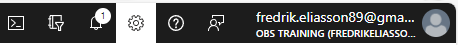
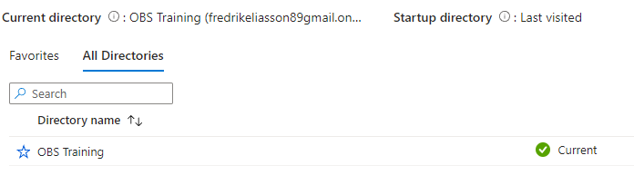

# Azure Training - Get Started

## Onboard your user to the Azure tenant
_Depending on whether the user was invited or created in the Azure Tenant, use the sub-topic that fits your scenario._

### Mail invitation for external user
* In the invitation sent to your mailbox, press the link in the mail to accept the invitation to the tenant.
  If needed, use your personal account details to login. 
* Once logged in to the [Azure Portal](https://portal.azure.com) you should now see your username and the current directory context.
  
  _If the directory context is not the one expected for the training, go to your user-settings to switch to the expected directory._ 
  

  _Ensure the current directory is the expected directory for the Azure training_
  

### User created directly in the Azure tenant
* Firstly, you should have been provided with the username and password by the Azure tenant administrator.
* With the supplied username and password, go to the [Azure Portal](https://portal.azure.com), login using the provided user credentials.
  * If this is the first time you login, the current password is temporary, and you will need to reset it to the password you want.