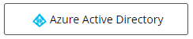
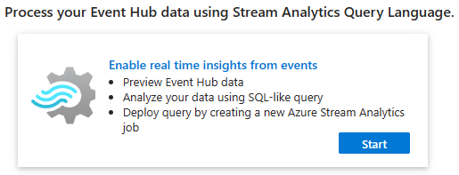
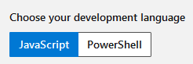

# Azure Training for SHB - Practical Exercises
_The exercises in this section should primarily be performed logged in to the [Azure Portal](https://portal.azure.com), or using tools such as **Powershell** or **Azure CLI**_.<br>

##### Legend for exercises
:exclamation: - _Step or instruction is highly likely to run into problem/error that your goal is to solve._<br>
:link: - _Step or instruction assumes a prior step or exercise has been performed.
If instructions are in code, it is assumed the same workspace or process is used as from prior steps._<br>

---
## Table of contents for exercises
_Azure API Management_

1. [Exercise - Register your user for the APIM Developer portal](#exercise---register-your-user-for-the-apim-developer-portal)
2. [Exercise - Explore the APIs inside the APIM Developer portal](#exercise---explore-the-apis-inside-the-apim-developer-portal)
3. [Exercise - Create your own API on the APIM resource](#exercise---create-your-own-api-on-the-apim-resource)
4. [Exercise - Add operations to your API](#exercise---add-operations-to-your-api)
5. [Exercise - Test your API operations](#exercise---test-your-api-operations)
6. [Exercise - Add a new revision of your API](#exercise---add-a-new-revision-of-your-api)
7. [Exercise - Add your API as part of a product](#exercise---add-your-api-as-part-of-a-product)
8. [Exercise - Test inbound processing to rewrite the URL for your API endpoint](#exercise---test-inbound-processing-to-rewrite-the-url-for-your-api-endpoint)

_Azure Event Hubs_

9. [Exercise - Create an Event Hub namespace](#exercise---create-an-event-hub-namespace)
10. [Exercise - Add an Event Hub to your Event Hub namespace using Azure Portal](#exercise---add-an-event-hub-to-your-event-hub-namespace-using-azure-portal)
11. [Exercise - Add an Event Hub to your Event Hub namespace using Powershell](#exercise---add-an-event-hub-to-your-event-hub-namespace-using-powershell)
12. [Exercise - Generate some test messages to your Event Hub](#exercise---generate-some-test-messages-to-your-event-hub)
13. [Exercise - Stream Diagnostic Settings data to your Event Hub](#exercise---stream-diagnostic-settings-data-to-your-event-hub)
14. [Exercise - Create a private endpoint and privatelink for your Event Hub Namespace](#exercise---create-a-private-endpoint-and-privatelink-for-your-event-hub-namespace)

_Azure Function Apps_

15. [Exercise - Create a function app in the Azure portal (Microsoft Learn)](#exercise---create-a-function-app-in-the-azure-portal-microsoft-learn)
16. [Exercise - Add logic to the function app (Microsoft Learn)](#exercise---add-logic-to-the-function-app-microsoft-learn)
17. [Exercise - Explore the service site (SCM) of your Azure Function App](#exercise---explore-the-service-site-scm-of-your-azure-function-app)
18. [Exercise - Create a PowerShell function in Azure using Visual Studio Code](#exercise---create-a-powershell-function-in-azure-using-visual-studio-code)
19. [Exercise - Connect Azure Functions to Azure Storage using Visual Studio Code](#exercise---connect-azure-functions-to-azure-storage-using-visual-studio-code)

---
## Azure API Management
_In these exercises we will be using a prepared Azure API Management service resource. See the APIM resource details [here](ENVIRONMENT.md#azure-api-management-resource). There will be instructions where these values should be used._

---
### Exercise - Register your user for the APIM Developer portal
1. Go to the `<APIM-DEVELOPER-PORTAL-URL>`.
2. In the upper right corner, press `Sign in`.
3. Press the `Azure Active Directory` button.

    

4. Use your Azure credentials to sign in, thereafter complete the registration.

---
### Exercise - Explore the APIs inside the APIM Developer portal
1. :link: Once signed into the APIM Developer Portal, go to `APIs` in the upper right corner.
2. Explore the `Test API`
    * What can we do from here?

---
### Exercise - Create your own API on the APIM resource
:information_source: _The APIM resource will be shared between the students, performing certain actions will make the entirety of the APIM resource update itself, leading to a read-only state until the operation is done. Do not press around recklessly on the APIM resource._

1. In the portal, go to `API Management services`.
2. Press the APIM resource called `<APIM-NAME>`.
3. In the left side menu, press `APIs`.

_Here you will see the already existent APIs of the APIM, and how they are currently configured._<br>
_For our lab-scenario and the backend, we will be using a service-URL leading to a small REST API image, containing different endpoints to perform different actions._<br>
_You can browse the `<REST-API-ENDPOINTS-URL>` to see the available endpoints that can be called on this REST API image. The specific endpoints can be targeted by using `<REST-API-SERVICE-URL>` + `<ENDPOINT-URL>`._<br>

4. To start building your API, press `Add API`.
5. For this scenario, we will be using `HTTP - Manually define an HTTP API`.
6. In the `Create an HTTP API` pop-up window, use `Basic` and fill in the details.
    * `Display name` - _Set a descriptive name of your API._
    * `Name` - _Sets the name of the underlying sub-resource in APIM._
    * `Web service URL` - _Set the `<REST-API-SERVICE-URL>` value here._
    * `API URL suffix` - _This is the value used to call your specific API within the APIM._
      * Example - `<APIM-GATEWAY-URL>` + `/` + `<API URL suffix>` will reach your specific API within the API gateway.
7. Press `Create`.

_The below configuration is done to keep the simplicity of the APIs for the lab scenario._

8. Once the API is created, press `<Name-of-your-API>` and then the `Settings` tab.
9. Under `Subscription`, uncheck `Subscription required`.
10. Press `Save`.

---
### Exercise - Add operations to your API
:information_source: _See available endpoints on our lab REST API server by browsing to `<REST-API-ENDPOINTS-URL>`._

1. :link: In the left side menu, press `APIs`.
2. Press `<Name-of-your-API>` and then `Add operation`.
3. In the `Frontend` details on the right side, fill in the details.
    * `Display name` - _Set a descriptive name for your API operation._
    * `Name` - _Sets the name of the underlying sub-resource for the specific API._
    * `URL` 
      * On the left side, set the type of REST `Method` to be used for the operation. 
      * On the right side, set the URL that will be called to use this operation.
        * The full URL-path will be: 
        ```
        <APIM-GATEWAY-URL> + / + <API URL suffix> + / + <OPERATION-URL-VALUE>
        ```
    * `Description` - _Write a nice description what this operation is meant to perform. This should give upcoming API consumers a good understanding of what this endpoint operation performs._
4. Depending on `Method` used.
    * If you are using the `GET` method, you can now press `Save`.
    * If you are using such as the `POST` method, you need to go to the `Query` tab, and add the expected input parameters as we need to pass input data for the endpoint operation. Once added, press `Save`.

---
### Exercise - Test your API operations
1. :link: Press your API operation, and then go to the `Test` tab.
2. Depending on `Method` used.
    * If you are using the `GET` method, press `Send`.
    * If you are using such as the `POST` method, under `Query parameters`, fill in the values of the expected parameters for the operation and then press `Send`.

##### Test API operations programmatically using Powershell
1. Open up `pwsh` and use the following or similar approach:
   ``` Powershell
   # For GET request
   Invoke-WebRequest -Uri "<APIM-GATEWAY-URL>/<API URL suffix>/<OPERATION-URL-VALUE>" -Method Get

   # For POST request
   Invoke-WebRequest -Uri "<APIM-GATEWAY-URL>/<API URL suffix>/<OPERATION-URL-VALUE>" -Method Post -Body @{ ParameterName1 = "Value1" ; ParameterName2 = "Value2" }

   # Save the response to a variable and explore the Powershell object
   $Response = Invoke-WebRequest -Uri "<APIM-GATEWAY-URL>/<API URL suffix>/<OPERATION-URL-VALUE>" -Method Get
   $Response            # Take a look at whole object
   $Response.StatusCode # See the StatusCode within the object
   $Response.Content    # See the Content within the object
   ```

---
### Exercise - Add a new revision of your API
1. :link: In the left side menu, press `APIs`.
2. Press `<Name-of-your-API>`, and then go to the `Revisions` tab.
3. Press `Add revision`, write a revision description that summarizes what has been added since the last revision, and then press `Create`.

---
### Exercise - Add your API as part of a product
1. :link: In the left side menu, press `Products`.
2. Press `Add`, and then fill in the details.
    * `Display name` - _Set a descriptive name for your Product._
    * `Name` - _Sets the name of the underlying sub-resource for the specific Product in APIM._
    * `Description` - _Write a nice description what this product contains and what we can do with it._
    * `Published` - _Check this box, this indicates that it will be visible later in the Developer portal, once we have published the latest version of the portal._
    * `Requires subscription` - _Uncheck this box, for the ease of use during the lab scenario._
    * `Requires approval` - _Uncheck this box, for the ease of use during the lab scenario._
    * `Legal terms` - _Obviously you want to add here that we are ready to `sue` anyone who improperly uses our `Product`_ (so that we can make some easy :moneybag: :smirk:).
    * `APIs` - Use the `+` sign to add which APIs that should be part of the `Product`
3. Finally, press `Create`.

---
### Exercise - Test inbound processing to rewrite the URL for your API endpoint
1. :link: Create a new API operation, and name the endpoint whatever you like.
2. Once created, in the `Inbound processing` section, press `+ Add policy`.
3. Press the `Rewrite URL` policy.
4. Add a value to convert the request from how your APIM received it, to something that responds on the backend side.
5. Press `Save`.
6. Now test browsing to your new API operation and see what happends.

---
## Azure Event Hubs

### Exercise - Create an Event Hub namespace
:information_source: _A good naming standard for your resources would be to follow the [Abbreviation examples for Azure resources](https://learn.microsoft.com/en-us/azure/cloud-adoption-framework/ready/azure-best-practices/resource-abbreviations)_.<br>

1. In the portal, go to `Event Hubs`.
2. In the upper left corner, press `Create`.
3. On the `Basics` tab:
    * `Resource group` - _Set or create your desired resource-group for the Event Hub._
    * `Namespace name` - _Set your desired name for the Event Hub namespace._
    * `Location` - _Set the region to one of the intended regions for the training._ 
    * `Pricing tier` - _Set this as `Standard`._
    * `Throughput Units` - _Set this as low as possible, should be **1**._
    * `Enable Auto-Inflate` - _Ensure this is **not** checked in._ 
4. From here, you can press `Review + create` as we will keep the default values for the remaining sections.
    * Default values
        * `Advanced` tab
            * `Minimum TLS version` - _Version 1.2_
            * `Local authentication` - _Enabled_
        * `Networking`
            * `Connectivity method` - _Public access_
5. Finally, press `Create`.

---
### Exercise - Add an Event Hub to your Event Hub namespace using Azure Portal
1. :link: In the left side menu of your Event Hub namespace, press `Event Hubs`.
2. Press `+ Event Hub`.
3. On the `Basics` tab:
    * `Name` - _Set the desired name for your Event Hub._
    * `Partition count` - _Set this as low as possible, should be **1**._
    * `Cleanup policy` - _Set this to `Delete`._
    * `Retention time (hrs)` - _Set this to **1**._
4. On the `Capture` tab:
    * `Capture` - _This should be set to **Off**._
5. Press `Review + create`, and then `Create`.

---
### Exercise - Add an Event Hub to your Event Hub namespace using Powershell
1. :link: Open `pwsh` (Powershell), and use the below example as guidance.<br>

    :information_source: _You can find more information about this Azure Powershell cmdlet [here](https://learn.microsoft.com/en-us/powershell/module/az.eventhub/new-azeventhub?view=azps-10.4.1)._
``` Powershell
New-AzEventHub -Name "<Name-of-my-new-Event-Hub>" -NamespaceName "<Name-of-my-Event-Hub-Namespace>" -ResourceGroupName "<Name-of-the-resource-group-for-my-Event-Hub-Namespace>" -RetentionTimeInHour 1 -PartitionCount 1 -CleanupPolicy Delete
```

---
### Exercise - Generate some test messages to your Event Hub

##### Generate some test messages to your Event Hub in the Azure Portal
1. :link: In the left side menu of your **Event Hub**, press `Generate data (preview)`
2. Select any of the `Pre canned datasets` and how many times you would, and press `Send`.
3. In the left side menu of your Event Hub, press `Overview`.
4. You should now see `Requests`, `Messages` and `Throughput` for the messages that were sent.
8. To further explore the messages sent, use [Explore the messages using Stream Analytics Query Language](#explore-the-messages-using-stream-analytics-query-language)

##### Generate some test messages to your Event Hub programmatically using Powershell
1. :link: In the left side menu of your **Event Hub**, press `Shared access policies` and then `Add`.
2. For `Policy name`, set something descriptive. As we are going to use this policy to send messages, `Send` permission should be sufficient and should be checked in.
3. Press `Create`.
4. Once created, press the `<Name-of-your-shared-access-policy>.`
5. Copy one of the available connection strings, `Connection string–primary key` or `Connection string–secondary key` and save it down for now.
6. Download the script [EventHub-SendMessage.ps1](Scripts/EventHub-SendMessage.ps1) from the repository.
7. Open `pwsh` (Powershell), and use the below example as guidance.<br>
_This script will send dummy-messages containing a little bit of data to your Event-Hub using the connection-string._
``` Powershell
    # Set the connection string as a variable
    $ConnectionString = "<My-Event-Hub-Connection-String>"

    # Run the script with the input of your connection string
    .\EventHub-SendMessage.ps1 -ConnectionString $ConnectionString

    # Run the script again, this time also using another parameter input that sets how many messages we will send
    .\EventHub-SendMessage.ps1 -ConnectionString $ConnectionString -DummyMessagesTotal 50
```
<details>
  <summary><i>Example output from script</i></summary>

```
Sending 5 messages to event hub [eventhub2] within [obstraining-evh]
Sending message number 1

RandomValue                    444
MessageDate                    20231104-00:11:17
MessageGuid                    ae8328e6-0e96-421c-96ff-1a1784111122


StatusCode StatusDescription
---------- -----------------
       201 Created
```

</details>

8. Once the messages has been sent, [Explore the messages using Stream Analytics Query Language](#explore-the-messages-using-stream-analytics-query-language)

##### Explore the messages using Stream Analytics Query Language
1. :link: In the left side menu of your Event Hub, press `Process data`
2. Press `Start` here.



3. :exclamation: Press `Test query`, you should now see your generated messages.
    * The query is based on `SQL Syntax`, see [here](https://www.w3schools.com/sql/sql_syntax.asp) for further examples how you could modify your test query to show the data as you would like to see it.

---
### Exercise - Stream Diagnostic Settings data to your Event Hub
1. :link: Go to any resource that matches the **region** of your Event Hub Namespace that you would like to stream Diagnostic Settings from to your Event Hub.
2. In the left side of menu, go to `Diagnostic settings`, press `+ Add diagnostic setting`.
3. Check all available `Category groups` under `Logs`.
4. On the right side under `Destination details`, check `Stream to an event hub`.
    * `Subscription` - _Use the subscription where your Event Hub Namespace is located._
    * `Event hub namespace` - _Select your already created Event Hub Namespace._
    * `Event hub name` - _Either choose a specific Event Hub or stream your events to the whole Event Hub Namespace._
    * `Event hub policy name` - _Pick an existent policy that has at least `Send` permission._
5. Invoke any action that can generate diagnostic logs for your resource, and then you should be able to find the streamed events on your Event Hub using the approach in [Explore the messages using Stream Analytics Query Language](#explore-the-messages-using-stream-analytics-query-language).

---
### Exercise - Create a private endpoint and privatelink for your Event Hub Namespace
1. :link: In the portal, go to `Event Hubs`, press `<Name-of-your-Event-Hub-namespace>`.
2. In the left side menu, go to `Networking`, and then `Private endpoint connections`.
3. Press `+ Private endpoint`.
4. On the `Basics` tab:
    * `Resource group` - Pick the same resource group as your Event Hub Namespace.
    * `Name` - Set a name for your private endpoint resource, the best practice abbreviation is `pep`.
    * `Network Interface Name` - Pick a name for your network interface that will be used by the PEP, the best practive abbreviation is `nic`.
    * `Region` - Set the same region as your Event Hub Namespace.
5. Press `Next: Resource`.
6. On the `Resource` tab, set `Target sub-resource` as `namespace`.
7. Press `Next: Virtual Network`.
8. On the `Virtual Network` tab:
    * `Virtual network` - Choose an already created Virtual Network (VNet) if possible, otherwise create a new VNet to proceed.
    * `Subnet` - Choose an already created Subnet if possible, otherwise create a new VNet to proceed.
    * `Private IP configuration` - Set this as `Dynamically allocate IP address`.
9. Press `Next: DNS`
10. On the `DNS` tab:
    * `Integrate with private DNS zone` - Should be set to `Yes`.
    * For the configuration of the DNS zone, try to think of a configuration/structure where we could use the same Private DNS Zone for multiple Event Hub Namespaces if possible.
11. Press `Next: Tags`.
12. Press `Next: Review + Create`.
13. Press `Create`.
    * Now test reaching your Event Hub Namespace from any other resource within your VNet, such as a VM for example.

---
## Azure Function Apps
:information_source: _Please note that there are two available development languages for the exercises, for follow up exercises for the Function App, ensure the same development language is used._



### Exercise - Create a function app in the Azure portal (Microsoft Learn)
_For this exercise we will be using an exercise from Microsoft Learn as it fits the intended scenario._<br>
_Recommended development language for the exercise is `Powershell`._

1. Follow the steps in the exercise found here - [Exercise - Create a function app in the Azure portal](https://learn.microsoft.com/en-us/training/modules/create-serverless-logic-with-azure-functions/3-create-an-azure-functions-app-in-the-azure-portal?pivots=powershell)

---
### Exercise - Add logic to the function app (Microsoft Learn)
_For this exercise we will be using an exercise from Microsoft Learn as it fits the intended scenario._<br>
_Recommended development language for the exercise is `Powershell`._

:information_source: _This exercise has examples using `curl`, if you do not have `curl` you will either need to download it, or use `Powershell` and the commands `Invoke-WebRequest` or `Invoke-RestMethod` instead._

1. :link: Follow the steps in the exercise found here - [Exercise - Add logic to the function app](https://learn.microsoft.com/en-us/training/modules/create-serverless-logic-with-azure-functions/5-add-logic-to-the-function-app?pivots=powershell)

---
### Exercise - Explore the service site (SCM) of your Azure Function App
1. :link: In the Azure Portal, go to `Function App` and then `<Name-of-your-Function-App>`.
2. Do either of the following: 

    _In the left side menu of your Function App, go to `Advanced Tools`, and then press the `Go` button._

    **or**

    _In the left side menu under `Overview`, copy the URL to your Function App._<br>
    _Take your copied URL and modify it like the following example:_
    ``` Powershell
    # Browse to the service site URL of your Function App - notice that we are adding 'scm' to the URL
    https://<Function-App-Name>.scm.azurewebsites.net
    ```

    * What can we do from here?

---
### Exercise - Create a PowerShell function in Azure using Visual Studio Code
_For this exercise we will be using a quickstart from the Microsoft documentation about Azure Function Apps to deploy a `Powershell` function to your Azure Function App._

1. Follow the steps in the exercise found here - [Exercise - Create a PowerShell function in Azure using Visual Studio Code](https://learn.microsoft.com/en-us/azure/azure-functions/create-first-function-vs-code-powershell)

---
### Exercise - Connect Azure Functions to Azure Storage using Visual Studio Code
_For this exercise we will be using an exercise from the Microsoft documentation about Azure Function Apps to connect your deployed function to an Azure Storage Account Queue._

1. :link: Follow the steps in the exercise found here - [Exercise - Connect Azure Functions to Azure Storage using Visual Studio Code](https://learn.microsoft.com/en-us/azure/azure-functions/functions-add-output-binding-storage-queue-vs-code?pivots=programming-language-powershell)